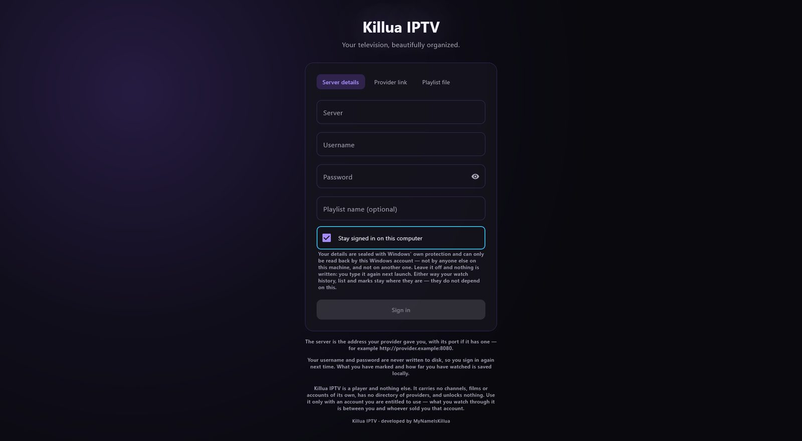
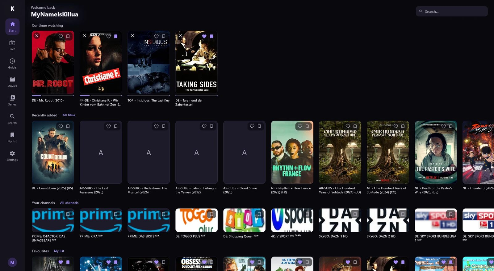
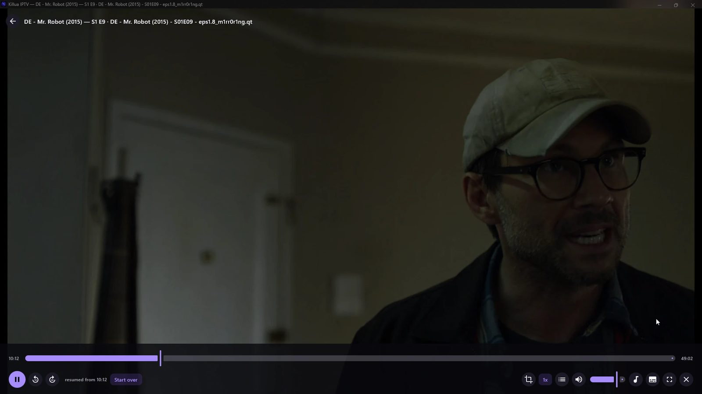
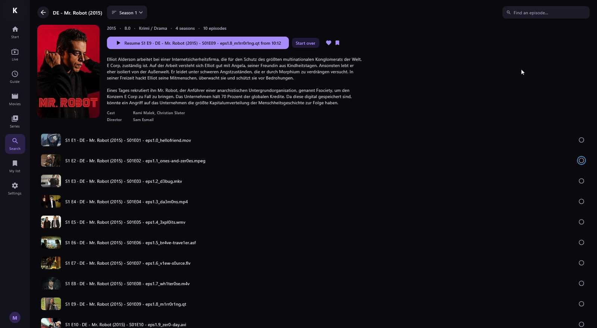
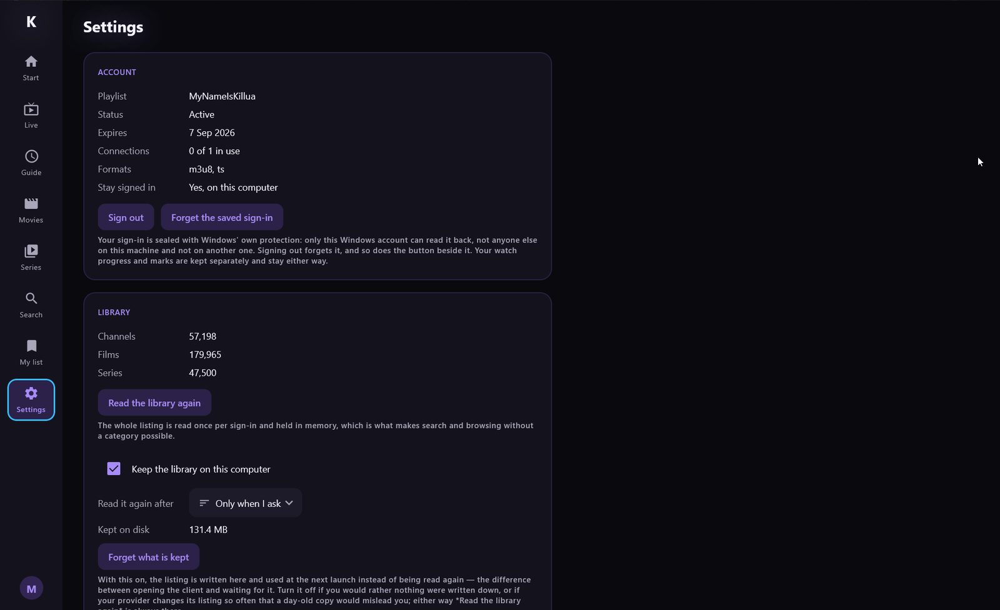
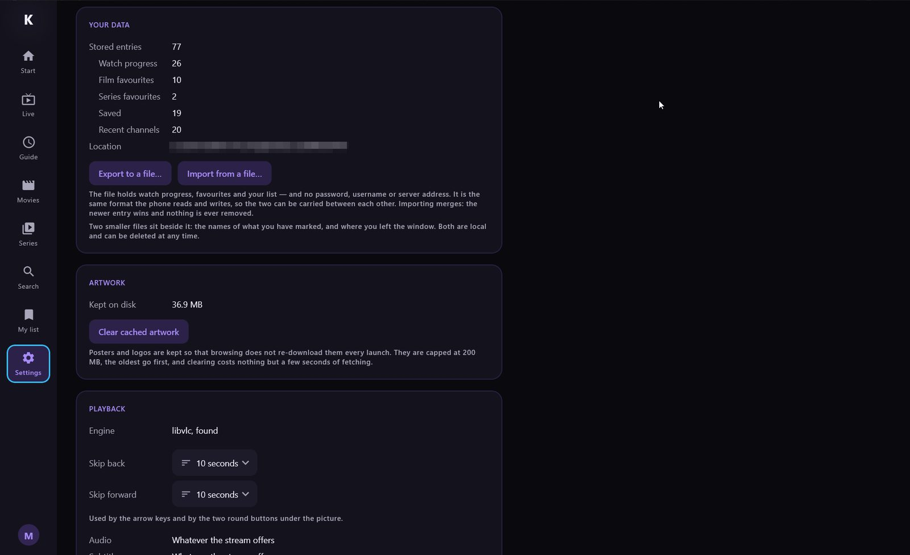
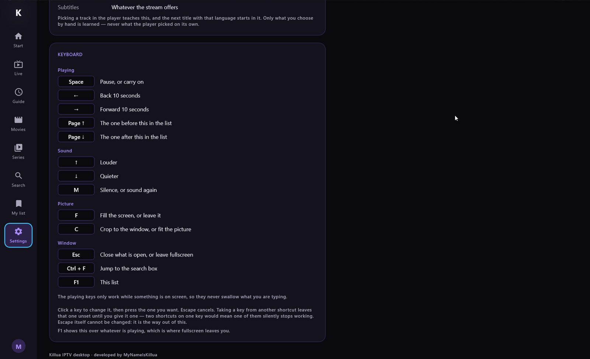

<p align="center">
  
</p>

<h1 align="center">Killua IPTV</h1>

<p align="center">
  <strong>A private-by-design IPTV player for your own Xtream-compatible account.</strong><br>
  Android, Fire TV and Windows.
</p>

<p align="center">
  Live TV, movies, series, EPG, search, saved content, and resume playback -
  without included content, ads, analytics, or a third-party account service.
</p>

<p align="center">
  
  
  
  
</p>

<p align="center">
  <a href="../../releases">Releases</a>
  · <a href="#installation">Installation</a>
  · <a href="docs/ROADMAP.md">Roadmap</a>
  · <a href="docs/SECURITY.md">Security</a>
  · <a href="#build-from-source">Build from source</a>
</p>

> [!IMPORTANT]
> Killua IPTV is a player, not an IPTV service. It ships with no channels,
> playlists, subscriptions, provider directory, or media. Use it only with a
> service and content you are legally authorized to access.

> [!NOTE]
> **1.0.0 is the first release that is not an alpha.** The Android app has been used daily against a
> real six-figure provider library for weeks. The Windows client is months younger, and the newest
> parts of it — reading `.m3u` playlists, the installer, the television layout — have not yet been
> through a full pass on real hardware. Xtream implementations vary, so compatibility with any one
> provider cannot be promised.

## Screenshots

### Android


<details>
  <summary><strong>Android — phone, tablet and Fire TV (8 images)</strong></summary>
  <br>

  <table>
    <tr>
      <td width="33%" align="center">
        
        <br><sub>Home and My List</sub>
      </td>
      <td width="33%" align="center">
        
        <br><sub>Movie details</sub>
      </td>
      <td width="33%" align="center">
        
        <br><sub>Series and episodes</sub>
      </td>
    </tr>
  </table>

  <p align="center">
    
    <br><sub>Immersive Media3 player</sub>
  </p>

  <table>
    <tr>
      <td width="50%" align="center">
        
        <br><sub>Initial library sync</sub>
      </td>
      <td width="50%" align="center">
        
        <br><sub>Account and library settings</sub>
      </td>
    </tr>
    <tr>
      <td width="50%" align="center">
        
        <br><sub>Playback and appearance</sub>
      </td>
      <td width="50%" align="center">
        
        <br><sub>Appearance and privacy</sub>
      </td>
    </tr>
  </table>
</details>

### Windows

<details>
  <summary><strong>Windows — the desktop client (7 images)</strong></summary>
  <br>

  <table>
    <tr>
      <td width="50%" align="center">
        
        <br><sub>Three ways in</sub>
      </td>
      <td width="50%" align="center">
        
        <br><sub>Start screen</sub>
      </td>
    </tr>
  </table>

  <p align="center">
    
    <br><sub>Playing, resumed where it was left</sub>
  </p>

  <table>
    <tr>
      <td width="50%" align="center">
        
        <br><sub>Series and episodes</sub>
      </td>
      <td width="50%" align="center">
        
        <br><sub>Account and library</sub>
      </td>
    </tr>
    <tr>
      <td width="50%" align="center">
        
        <br><sub>Your data, artwork and playback</sub>
      </td>
      <td width="50%" align="center">
        
        <br><sub>Keyboard shortcuts, all rebindable</sub>
      </td>
    </tr>
  </table>
</details>


## Installation

Everything is on the [releases page](../../releases).

| Your device | Download |
| --- | --- |
| Android phone or tablet | `Killua-IPTV-Android-1.0.3.apk` |
| **Fire TV Stick / Android TV** | `Killua-IPTV-Android-1.0.3.apk` — the same file |
| Windows, installed | `Killua-IPTV-Windows-1.0.3.msi` |
| Windows, no installer | `Killua-IPTV-Windows-1.0.3.zip` |

> [!NOTE]
> Nothing here is signed by a certificate authority, so Windows and Android both warn before
> installing. Each guide below says exactly which dialog to expect, so you can tell a normal message
> from a real problem.

<details>
<summary><strong>Android phone or tablet</strong></summary>
<br>

**Needs** Android 8.0 or newer.

1. Download the `.apk` and open it.
2. Android will say your browser is not allowed to install apps — tap **Settings**, allow it, go back.
3. Play Protect may offer to block it. Choose **Install anyway**; it says that about every app it has
   not seen before.

</details>

<details>
<summary><strong>Fire TV Stick or Android TV</strong></summary>
<br>

**The same file as Android.** There is no separate television build — the app checks what it is
running on and draws for a television when it is on one: wider margins so nothing falls off the
edge, larger text, and fewer, bigger posters. Verified on a Fire TV Stick (3rd generation, Fire OS 7).

A television has no file manager, so pick one of these.

**With the Downloader app — no computer needed**

1. Install **Downloader** from the Amazon Appstore.
2. **Settings → My Fire TV → Developer options → Install unknown apps**, and allow Downloader. If
   *Developer options* is missing: **Settings → My Fire TV → About**, then click **Fire TV Stick**
   seven times.
3. In Downloader, enter the address of the `.apk` and install what it fetches.

**From a computer, over the network**

1. On the television: **Settings → My Fire TV → Developer options → ADB debugging**, on.
2. **Settings → My Fire TV → About → Network** shows its IP. The computer must be on the same
   network — the same Wi-Fi, not a guest one.
3. Then, with the Android platform tools installed:

   ```bash
   adb connect THE-IP-ADDRESS:5555
   ```

4. The television asks whether to trust the computer — tick **Always allow**, accept, then:

   ```bash
   adb install Killua-IPTV-Android-1.0.3.apk
   ```

It lands on the Fire TV home screen under **Apps & Channels**, at the end of the row.

</details>

<details>
<summary><strong>Windows</strong></summary>
<br>

**Needs** [VLC](https://www.videolan.org/vlc/). The client plays through libvlc and does not bundle
it; without VLC it starts and says so rather than failing at the first channel.

**The installer** — `Killua-IPTV-Windows-1.0.3.msi`

Two dialogs come first and both are expected:

1. *"Windows protected your PC"* → **More info → Run anyway**. SmartScreen, reacting to an unsigned
   installer that was downloaded.
2. A request for administrator rights. The program installs into `%LOCALAPPDATA%\Killua IPTV`, but its
   uninstall entry is registered machine-wide, and that is what needs the permission.

Uninstalling removes the program and **keeps** `%LOCALAPPDATA%\KilluaIPTV` — your watch history,
favourites and list. Reinstalling finds them again.

**Or without installing** — `Killua-IPTV-Windows-1.0.3.zip`

Unpack it anywhere and run `Killua IPTV.exe`. Same program, no installer, no administrator prompt.

</details>

### What you need in every case

An **Xtream-compatible account you are entitled to use**, or the address of an `.m3u` playlist. This
program carries no channels, no films and no accounts of its own, and has no directory of providers.
What you watch through it is between you and whoever sold you the account.


## Features

- **Live TV, movies, and series** from a user-supplied Xtream-compatible account.
- **Fast local browsing** with cached libraries, paging, categories, search,
  sorting, and heuristic language filters - designed to remain responsive with
  very large provider catalogs.
- **A personal home screen** with My List, Continue Watching, Recently Added,
  and recently watched live channels.
- **Programme information** with now/next data and a four-hour guide for saved
  and recently watched channels.
- **Modern playback** powered by AndroidX Media3/ExoPlayer, including HLS and
  MPEG-TS live streams, Picture-in-Picture, and available audio or subtitle
  tracks.
- **Player gestures and controls** for seeking, play/pause, temporary playback
  speed, brightness, volume, picture size, previous/next episode, and
  cancellable episode autoplay.
- **Watch progress** with resume/restart, watched states, favorites, and
  progress shared consistently across movies and series.
- **Cached-first recovery** so library metadata remains available during a
  temporary provider or network outage.
- **In-app updates.** When a newer release is published, the app says so at
  launch and installs it for you — no browser, no manual download, and nothing
  to uninstall first. Optional, and explained where you switch it off.
- **Dark, light, and system themes** using Material 3.

## Privacy and security

Killua IPTV has no advertising, analytics, telemetry, remote configuration, or
project-operated account service.

**One exception, stated plainly: the app checks for updates.** Once a day at
launch it asks GitHub whether a newer release exists — a `GET` of a public JSON
file. It sends no account, no identifier, no device details, and nothing about
your library or what you watch; the `User-Agent` is the fixed string
`KilluaIPTV`. What it unavoidably reveals is your IP address and that the app
was opened, exactly as visiting any web page would. It is on by default because
this app is sideloaded and has no store to tell you a fix exists, and it can be
turned off in **Settings → Updates** — with that same reason printed beside the
switch. Turned off, the app contacts nobody but your own provider.

- Credentials are encrypted at rest with AES-256-GCM using a non-exportable
  Android Keystore key.
- Credentials are sent only to the IPTV provider you configure, as required for
  authentication and playback.
- Library metadata, preferences, saved items, and watch progress stay on the
  device.
- App backup is disabled, and credentials are never stored in the Room database.
- Logout removes the encrypted credential record and all locally cached data for
  that account.

HTTPS is strongly recommended. Some providers support only HTTP; the app allows
it after a successful connection test and displays a cleartext warning. HTTP can
expose credentials and viewing traffic to anyone able to observe the network.

A provider-issued Xtream account URL normally contains the username and password
in plain text. Treat the complete URL like a password and never include it in an
issue, screenshot, log, or message.

See [Security and privacy](docs/SECURITY.md) for the full data flow and threat
model.

## Requirements and limitations

Three ways in, and not all of them work everywhere:

| Way in | Android | Windows |
| --- | :---: | :---: |
| Server address, user name and password | yes | yes |
| A provider's `get.php` / `player_api.php` link | yes | yes |
| A plain `.m3u` playlist address | yes | yes |

A playlist is **Live only** — the format has no films, series or guide — so those disappear from the
rail rather than standing empty. Every address read out of a playlist is checked before it is
opened: `http` and `https` only, no credentials inside the address, and never a loopback or private
host, so a playlist cannot aim the program at something on your own network.

Channels that need one carry their `http-user-agent` and `http-referrer` through to the player.
Without those, roughly one channel in sixteen of a public playlist answers 403 — which looks exactly
like a stream that is simply broken.

One saved account at a time. Killua IPTV does not bypass DRM, access controls, or provider
connection limits.

## Build from source

### Prerequisites

- Android Studio
- Android SDK 36
- JDK 17

No IPTV credentials or provider-specific configuration are needed to compile the
project or run its automated tests. The Gradle wrapper is included.

### Android Studio

1. Open the repository root.
2. Select JDK 17 as the Gradle JDK.
3. Install Android SDK 36 if prompted and let Gradle sync finish.
4. Select the `app` run configuration and an API 26+ device or emulator.
5. Run the app.

### Command line

Windows:

```powershell
.\gradlew.bat testDebugUnitTest assembleDebug lintDebug
```

macOS or Linux:

```bash
./gradlew testDebugUnitTest assembleDebug lintDebug
```

The debug APK is written to:

```text
app/build/outputs/apk/debug/app-debug.apk
```

Release builds require a local signing configuration and intentionally fail
before packaging when it is missing. See
[Release identity and signing](docs/RELEASE.md).

## Tech stack

| Area | Technology |
| --- | --- |
| Language and UI | Kotlin, Jetpack Compose, Material 3 |
| Playback | AndroidX Media3, ExoPlayer, MediaSession |
| Networking | Retrofit, OkHttp, Kotlin Serialization |
| Local data | Room, Paging 3, Preferences DataStore |
| Credential storage | Android Keystore, AES-256-GCM |
| Architecture | Layered UI/domain/data packages with repository contracts and manual dependency composition |

## Legal notice

Killua IPTV is an independent media player. It does not provide, host, sell,
promote, or redistribute channels, playlists, subscriptions, or media, and it is
not affiliated with or endorsed by any IPTV provider.

Users are responsible for ensuring they are authorized to access every service
and item of content they configure.

## Reporting issues

When reporting a compatibility problem, include the Android version, device
model, whether the provider uses HTTP or HTTPS, and the affected media type.
Remove all credentials, authenticated URLs, account identifiers, provider data,
and private endpoints before sharing anything.

## Contributors

<table>
  <tr>
    <td width="25%" align="center">
      <a href="https://github.com/MyNameIsKillua">
        
        <br><sub><strong>MyNameIsKillua</strong></sub>
      </a>
      <br><sub>Creator and maintainer</sub>
    </td>
    <td width="25%" align="center">
      <a href="https://github.com/apps/claude">
        
        <br><sub><strong>Claude</strong></sub>
      </a>
      <br><sub>Development assistance</sub>
    </td>
    <td width="25%" align="center">
      <a href="https://github.com/apps/chatgpt-codex-connector">
        
        <br><sub><strong>OpenAI Codex</strong></sub>
      </a>
      <br><sub>Development and documentation</sub>
    </td>
    <td width="25%" align="center">
      <a href="https://github.com/apps/dependabot">
        
        <br><sub><strong>Dependabot</strong></sub>
      </a>
      <br><sub>Dependency automation</sub>
    </td>
  </tr>
</table>

<sub>AI-assisted changes are reviewed and committed by the maintainer.</sub>

## Documentation

- [Architecture](docs/ARCHITECTURE.md)
- [Xtream-compatible API adapter](docs/XTREAM_API.md)
- [Player behavior](docs/PLAYER.md)
- [Database and local data](docs/DATABASE.md)
- [Security and privacy](docs/SECURITY.md)
- [Release identity and signing](docs/RELEASE.md)
- [Roadmap](docs/ROADMAP.md)

## Support

Killua IPTV is free, has no ads, and asks for nothing to work. If you would like to support the
time that goes into it, you can — it is entirely optional, and it unlocks nothing.

To be explicit about what a donation is and is not: it supports development of the app. It does
not buy, include, or provide access to any content, channel, or IPTV account. You still bring
your own.

<a href="https://ko-fi.com/mynameiskillua">
  
</a>

### Crypto

| Coin | Networks | Address |
| --- | --- | --- |
| Ethereum (ETH) | Ethereum, Base, Polygon and other EVM networks — ETH or tokens such as USDT | `0xf7eb4632aae7a1cc875e0fdbf295cec8d800cbff` |
| Solana (SOL) | Solana only | `2RfUQEPXqA5yAAAJMB4RBe7vTet3pHdLRNYTUoYHdGE7` |
| Bitcoin (BTC) | Bitcoin only — native SegWit | `bc1qmnhw0pvsxq7jv5f09yxjqhqa0xp3898tklmv8e` |

> **Check the network before you send.** The EVM address is one account across Ethereum, Base,
> Polygon and the rest — but a transfer sent on a chain that is not in that list, or a Solana
> transfer sent to the EVM address, is lost with no way to return it. Copy the address rather than
> typing it.

The same link and the same addresses are in the app, under **Settings → Support**, on Windows and
Android alike. They come from one file in the shared module, so the app and this page cannot drift
apart.

## Contact

You can find more of my work on [GitHub](https://github.com/MyNameIsKillua?tab=repositories), visit [mynameiskillua.de](https://mynameiskillua.de), or contact me directly on Discord.

<a href="https://discord.com/users/873559728825974874">
  
</a>

---

Developed and maintained by [MyNameIsKillua](https://github.com/MyNameIsKillua).
