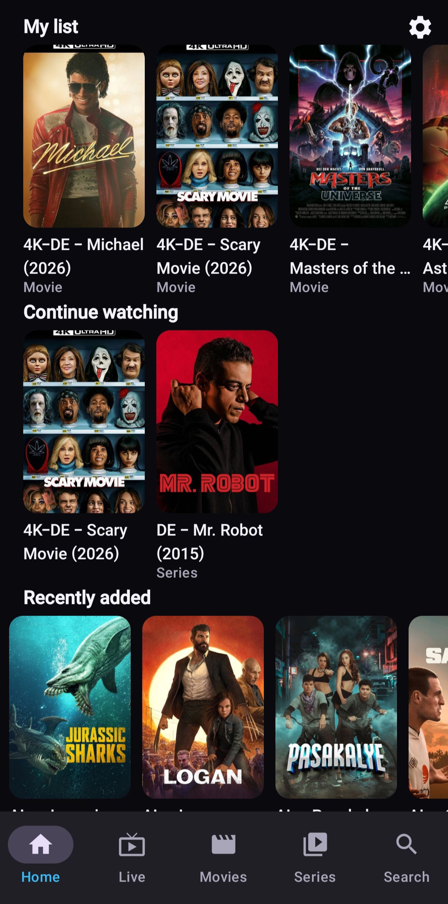
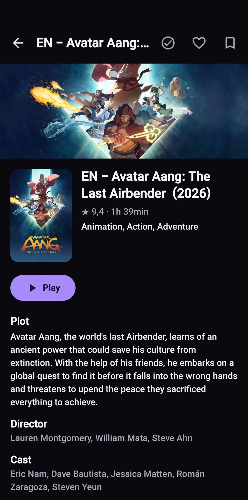
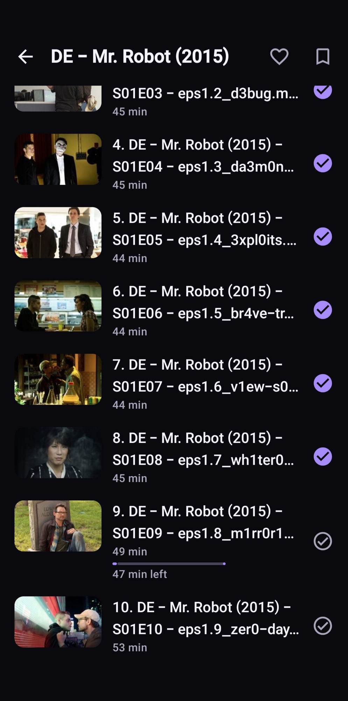
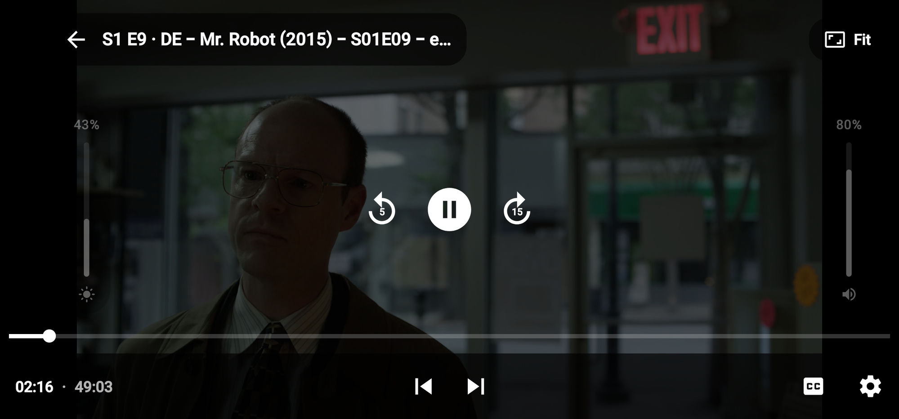
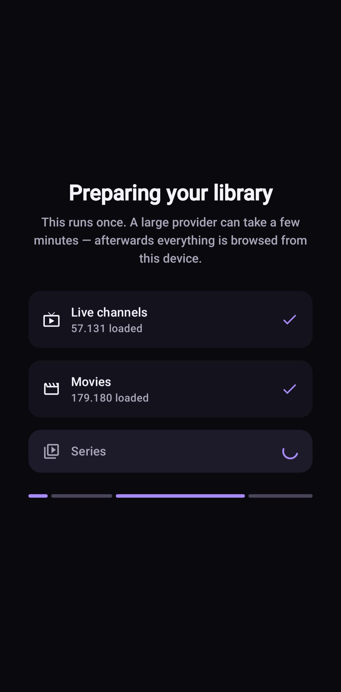
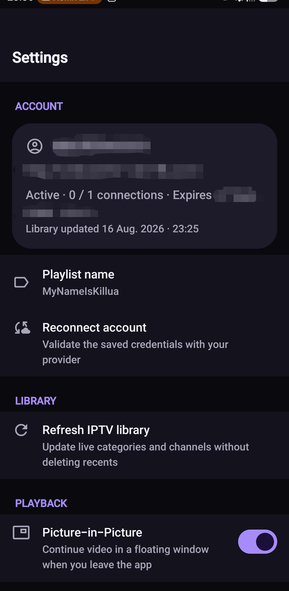
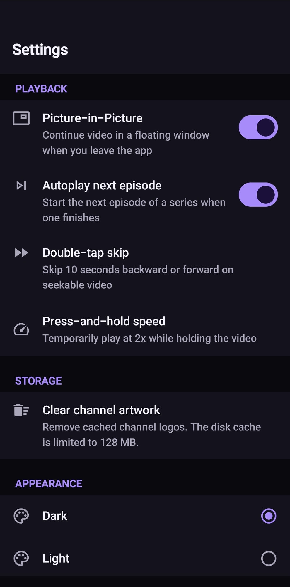
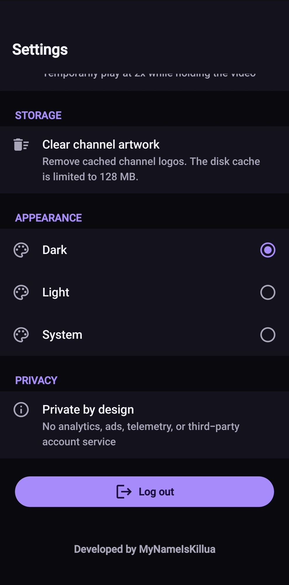

<p align="center">
  
</p>

<h1 align="center">Killua IPTV</h1>

<p align="center">
  <strong>A private-by-design Android IPTV player for your own Xtream-compatible account.</strong>
</p>

<p align="center">
  Live TV, movies, series, EPG, search, saved content, and resume playback -
  without included content, ads, analytics, or a third-party account service.
</p>

<p align="center">
  
  
  
</p>

<p align="center">
  <a href="../../releases">Releases</a>
  · <a href="docs/ROADMAP.md">Roadmap</a>
  · <a href="docs/SECURITY.md">Security</a>
  · <a href="#build-from-source">Build from source</a>
</p>

> [!IMPORTANT]
> Killua IPTV is a player, not an IPTV service. It ships with no channels,
> playlists, subscriptions, provider directory, or media. Use it only with a
> service and content you are legally authorized to access.

> [!WARNING]
> The project is under active alpha development. Features, storage formats, and
> compatibility with individual provider implementations may still change.

## Screenshots

<details>
  <summary><strong>Open the complete screenshot gallery (8 images)</strong></summary>
  <br>

  <table>
    <tr>
      <td width="33%" align="center">
        
        <br><sub>Home and My List</sub>
      </td>
      <td width="33%" align="center">
        
        <br><sub>Movie details</sub>
      </td>
      <td width="33%" align="center">
        
        <br><sub>Series and episodes</sub>
      </td>
    </tr>
  </table>

  <p align="center">
    
    <br><sub>Immersive Media3 player</sub>
  </p>

  <table>
    <tr>
      <td width="50%" align="center">
        
        <br><sub>Initial library sync</sub>
      </td>
      <td width="50%" align="center">
        
        <br><sub>Account and library settings</sub>
      </td>
    </tr>
    <tr>
      <td width="50%" align="center">
        
        <br><sub>Playback and appearance</sub>
      </td>
      <td width="50%" align="center">
        
        <br><sub>Appearance and privacy</sub>
      </td>
    </tr>
  </table>
</details>

## Features

- **Live TV, movies, and series** from a user-supplied Xtream-compatible account.
- **Fast local browsing** with cached libraries, paging, categories, search,
  sorting, and heuristic language filters - designed to remain responsive with
  very large provider catalogs.
- **A personal home screen** with My List, Continue Watching, Recently Added,
  and recently watched live channels.
- **Programme information** with now/next data and a four-hour guide for saved
  and recently watched channels.
- **Modern playback** powered by AndroidX Media3/ExoPlayer, including HLS and
  MPEG-TS live streams, Picture-in-Picture, and available audio or subtitle
  tracks.
- **Player gestures and controls** for seeking, play/pause, temporary playback
  speed, brightness, volume, picture size, previous/next episode, and
  cancellable episode autoplay.
- **Watch progress** with resume/restart, watched states, favorites, and
  progress shared consistently across movies and series.
- **Cached-first recovery** so library metadata remains available during a
  temporary provider or network outage.
- **Dark, light, and system themes** using Material 3.

## Privacy and security

Killua IPTV has no advertising, analytics, telemetry, remote configuration, or
project-operated account service.

- Credentials are encrypted at rest with AES-256-GCM using a non-exportable
  Android Keystore key.
- Credentials are sent only to the IPTV provider you configure, as required for
  authentication and playback.
- Library metadata, preferences, saved items, and watch progress stay on the
  device.
- App backup is disabled, and credentials are never stored in the Room database.
- Logout removes the encrypted credential record and all locally cached data for
  that account.

HTTPS is strongly recommended. Some providers support only HTTP; the app allows
it after a successful connection test and displays a cleartext warning. HTTP can
expose credentials and viewing traffic to anyone able to observe the network.

A provider-issued Xtream account URL normally contains the username and password
in plain text. Treat the complete URL like a password and never include it in an
issue, screenshot, log, or message.

See [Security and privacy](docs/SECURITY.md) for the full data flow and threat
model.

## Requirements and limitations

To use the app, you need:

- Android 8.0 / API 26 or later
- Network access to your provider
- Your own authorized Xtream-compatible server URL, username, and password

You can also sign in with a provider-issued Xtream `get.php` or
`player_api.php` account URL containing those credentials. Arbitrary local or
remote M3U playlists are not supported.

The current version supports one saved account. Xtream implementations vary, so
compatibility cannot be guaranteed for every provider. Killua IPTV does not
bypass DRM, access controls, or provider connection limits.

## Build from source

### Prerequisites

- Android Studio
- Android SDK 36
- JDK 17

No IPTV credentials or provider-specific configuration are needed to compile the
project or run its automated tests. The Gradle wrapper is included.

### Android Studio

1. Open the repository root.
2. Select JDK 17 as the Gradle JDK.
3. Install Android SDK 36 if prompted and let Gradle sync finish.
4. Select the `app` run configuration and an API 26+ device or emulator.
5. Run the app.

### Command line

Windows:

```powershell
.\gradlew.bat testDebugUnitTest assembleDebug lintDebug
```

macOS or Linux:

```bash
./gradlew testDebugUnitTest assembleDebug lintDebug
```

The debug APK is written to:

```text
app/build/outputs/apk/debug/app-debug.apk
```

Release builds require a local signing configuration and intentionally fail
before packaging when it is missing. See
[Release identity and signing](docs/RELEASE.md).

## Tech stack

| Area | Technology |
| --- | --- |
| Language and UI | Kotlin, Jetpack Compose, Material 3 |
| Playback | AndroidX Media3, ExoPlayer, MediaSession |
| Networking | Retrofit, OkHttp, Kotlin Serialization |
| Local data | Room, Paging 3, Preferences DataStore |
| Credential storage | Android Keystore, AES-256-GCM |
| Architecture | Layered UI/domain/data packages with repository contracts and manual dependency composition |

## Legal notice

Killua IPTV is an independent media player. It does not provide, host, sell,
promote, or redistribute channels, playlists, subscriptions, or media, and it is
not affiliated with or endorsed by any IPTV provider.

Users are responsible for ensuring they are authorized to access every service
and item of content they configure.

## Reporting issues

When reporting a compatibility problem, include the Android version, device
model, whether the provider uses HTTP or HTTPS, and the affected media type.
Remove all credentials, authenticated URLs, account identifiers, provider data,
and private endpoints before sharing anything.

## Contributors

<table>
  <tr>
    <td width="25%" align="center">
      <a href="https://github.com/MyNameIsKillua">
        
        <br><sub><strong>MyNameIsKillua</strong></sub>
      </a>
      <br><sub>Creator and maintainer</sub>
    </td>
    <td width="25%" align="center">
      <a href="https://github.com/apps/claude">
        
        <br><sub><strong>Claude</strong></sub>
      </a>
      <br><sub>Development assistance</sub>
    </td>
    <td width="25%" align="center">
      <a href="https://github.com/apps/chatgpt-codex-connector">
        
        <br><sub><strong>OpenAI Codex</strong></sub>
      </a>
      <br><sub>Development and documentation</sub>
    </td>
    <td width="25%" align="center">
      <a href="https://github.com/apps/dependabot">
        
        <br><sub><strong>Dependabot</strong></sub>
      </a>
      <br><sub>Dependency automation</sub>
    </td>
  </tr>
</table>

<sub>AI-assisted changes are reviewed and committed by the maintainer.</sub>

## Documentation

- [Architecture](docs/ARCHITECTURE.md)
- [Xtream-compatible API adapter](docs/XTREAM_API.md)
- [Player behavior](docs/PLAYER.md)
- [Database and local data](docs/DATABASE.md)
- [Security and privacy](docs/SECURITY.md)
- [Release identity and signing](docs/RELEASE.md)
- [Roadmap](docs/ROADMAP.md)

---

Developed and maintained by [MyNameIsKillua](https://github.com/MyNameIsKillua).
